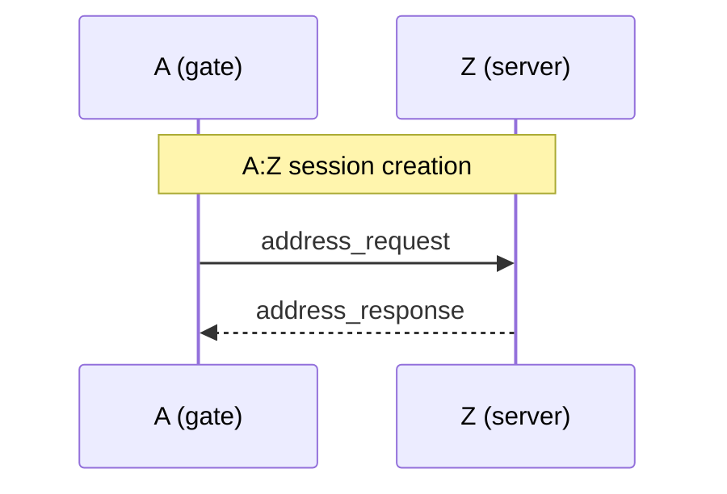
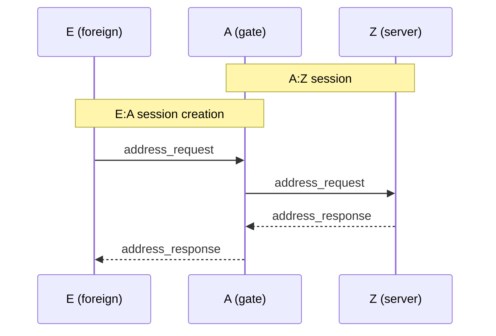
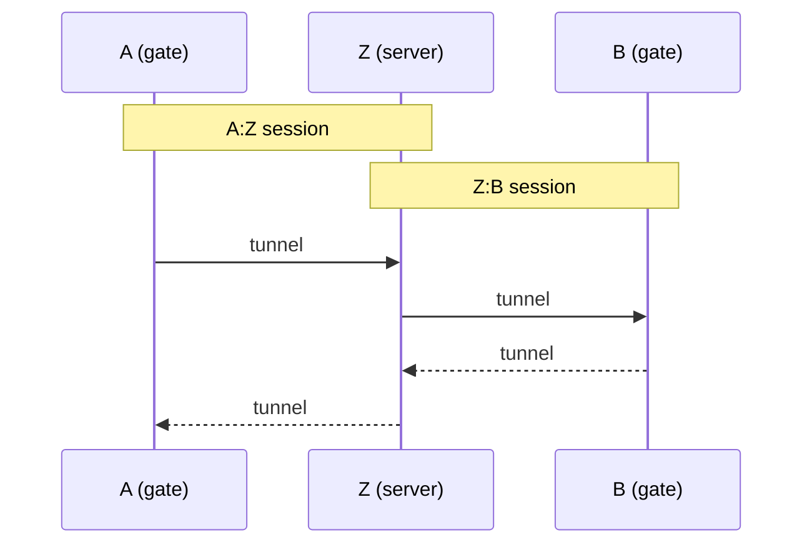
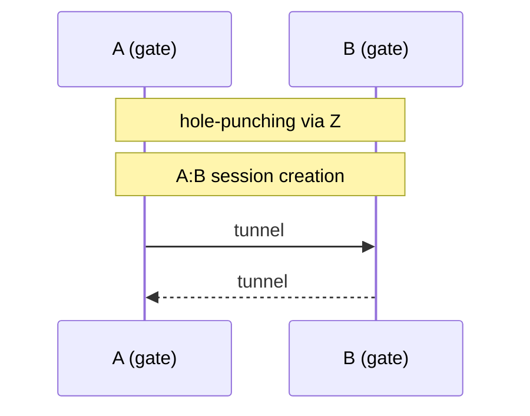
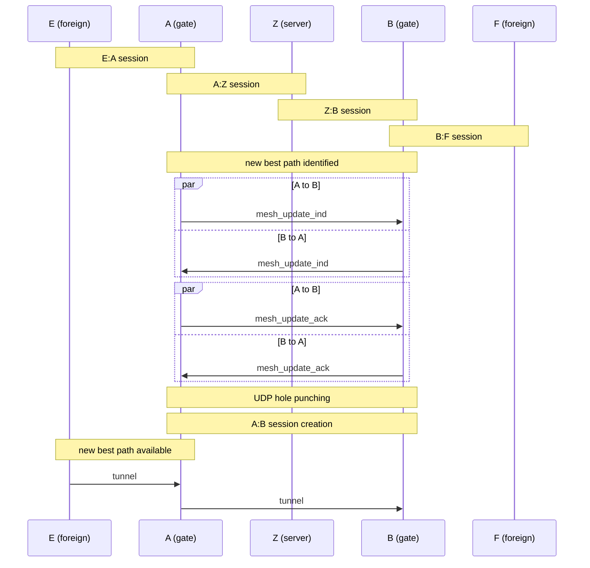

# transport - tunnel and mesh

## node types:
- server node : provides IP and default L3 switching
- gate node : can do L3 switching over gate2gate tunnel, relay foreign node
- foreign node : it connects the mesh over the gate nodes

## connections:
- Gate nodes connects to server node and aquires IP.
- Foreign node connects to gate node, and aquires IP.
- Gate nodes connects to all other gate nodes through hole punching, it maintains link state.
- Server node pick up all gate node link states to build a mesh map
- A gate node can forward tunnel message from one node to other node (non server node).

## messages
```
sequence ipv4_request
{
  u16 request_id;
  u8 client_public_key[];
};

sequence ipv4_response
{
  u16 request_id;
  u8 status;
  optional u32 ipv4;
};

sequence gate_list_request
{
  request_id;
};

sequence gate
{
  u64 gate_id;
  choice
  {
    u32 v4;
    u128 v6;
  } public_access_host;
  u16 public_access_port;
  u32 lan_host_v4;
  u16 lan_port;

  buffer<u8> gate_public_key;
};

sequence gate_list_response
{
  u16 request_id;
  list<gate> gate_list;
};

sequence gate_update
{
  u8 action;
  choice {
    gate gate;
    u64 gate_id;
  } update;
};

sequence gate_list_update_indication
{
  u16 request_id;
  list<gate_update> gate_update;
};

sequence gate_list_update_acknowledge
{
  u16 request_id;
};

sequence hole_punch_request
{
  u16 request_id;
  u64 peer_gate_id;
};

sequence hole_punch_sync_request
{
  u16 request_id;
  u64 peerA_gate_id;
  u64 peerB_gate_id;
};

sequence hole_punch_sync_response
{
  u16 request_id;
};

sequence gate2gate_state
{
  u64 peer_gate_id;
  u64 forward_trip_time_us;
  u64 reverse_trip_time_us;
  u64 forward_drop_rate_pkt_s;
  u64 reverse_drop_rate_pkt_s;
  u64 forward_throughput_byt_s;
  u64 reverse_trhoughput_byt_s;
};

sequence gate2gate_state_indication
{
  u64 source_gate_id;
  list<gate2gate_state> link_list;
};

sequence route_candidates_request
{
  u64 request_id;
};

sequence routes;

sequence route_candidates_response
{

}

sequence l3_tunnel
{
  list<u64> gateway_route;
  buffer<u8> l3_sdu;
}
```

## callflows:

### participants
A,B,C,D - gate<br/>
E,F,G,H - foreign<br/>
Z - server

### gate node initial flow (A:Z), IP Address Acquisition


### foreign node initial flow (E:A), IP Address Acquisition


### tunnel flow (A:B, via default), direct path not available


### tunnel flow (A:B direct), direct path becomes available


### full tunnel flow (E:F, via A,B)

